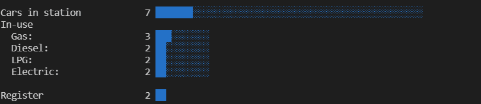

# ITE-CTC2022

Ulohy z předmětu ITE/CTC v letním semestru roku 2021/2022.  
VScode devcontainer pro GO na [GitHubu](https://github.com/microsoft/vscode-remote-try-go)

## Task 01

Fibonacci closure

|
[Task 01 folder](task01/)
|
[Program main](task01/main.go)
|

## Task 02

Gas station simulation

|
[Task 02 folder](task02/)
|
[Program main](task02/main.go)
|


## Task 03

Api server

|
[Task 03 folder](task03/)
|
[Program backend](task03/backend//main.go)
|
[Program test client](task03/frontend/main.go)
|
  
Rest API using gorrila/mux storing data into mongodb.  
Testing client using react app to directly querry API.

Usage:

```bash
    cd ./task03
    docker-compose up
```

Testing client: [http://localhost:9001/](http://localhost:9001/)

## Task 04

Api server

|
[Task 04 folder](task04/)
|

Same as task 03 but without test client and image is build and pushed to docker hub.

Usage:

```bash
    cd ./task04
    docker-compose up
```

## Task 05

|
[Task 05 folder](task05/)
|
[Program server](task05/grpc/server/main.go)
|
[Program client](task05/grpc/client/main.go)
|

Task 05 is a simple grpc server and client, which uses react app to display data and send requests.

Usage:

```bash
    cd ./task05
    docker-compose up
```

Testing client: [http://localhost:8080/](http:/localhost:8080/)
